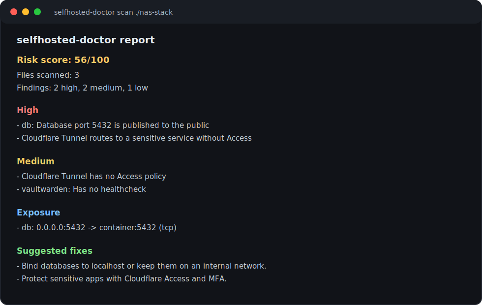

# selfhosted-doctor

AI-ready security checks for self-hosted homelabs, starting with Docker Compose.

> Before exposing your NAS to the internet, run one command.

`selfhosted-doctor` is a local-first security doctor for people who run services on a NAS, VPS, or homelab with Docker Compose, reverse proxies, and Cloudflare Tunnel.

The goal is not to replace Trivy, Checkov, or enterprise security scanners. The goal is to catch the common self-hosted mistakes that happen right before a private service becomes public.



## Quickstart

```bash
npx selfhosted-doctor scan docker-compose.yml
```

Scan a whole directory (finds every `docker-compose*.yml` / `compose*.yml`, `.env`, and `cloudflared` config):

```bash
npx selfhosted-doctor scan ./my-stack
```

Example output:

```text
selfhosted-doctor report

Risk score: 56/100
Files scanned: 3
Findings: 2 high, 2 medium, 1 low

High
- db: Database port 5432 is published to the public (docker-compose.yml)
- Cloudflare Tunnel routes to a sensitive service without Access (cloudflared/config.yml)

Medium
- Cloudflare Tunnel has no Access policy (cloudflared/config.yml)
- vaultwarden: Has no healthcheck (docker-compose.yml)

Low
- db: Image is not pinned by digest (docker-compose.yml)

Exposure
- db: 0.0.0.0:5432 -> container:5432 (tcp)
```

Every finding comes with a concrete fix. Run `-f markdown` (or `selfhosted-doctor explain`) to get the **Suggested Fixes** section:

```text
- Bind the database to localhost only (e.g. 127.0.0.1:5432:5432) or keep it on an internal network.
- Protect sensitive apps with a Cloudflare Access policy and MFA before tunneling them to the public internet.
- Add a healthcheck so the container is restarted when it becomes unhealthy.
```

## Commands

```bash
selfhosted-doctor scan [path]                 # terminal report (default command)
selfhosted-doctor scan [path] -f json         # machine-readable JSON (AI-ready)
selfhosted-doctor scan [path] -f markdown     # Markdown report
selfhosted-doctor scan [path] -o report.md    # write to a file (format inferred from extension)
selfhosted-doctor scan [path] --fail-on high  # exit non-zero for CI when a high risk exists
selfhosted-doctor explain [path]              # plain-language explanation of the findings
selfhosted-doctor mcp                         # run the read-only MCP server over stdio
```

`path` can be a Compose file (`docker-compose.yml`, `compose.yml`) or a directory. When you point it at a single file, sibling `.env` and `cloudflared` config files in the same folder are scanned too.

`--fail-on high|medium|low` makes the process exit `1` when a finding at or above that severity exists — handy in a pre-deploy CI step. The default is `none` (always exit `0`).

### Compose profiles

Services behind a Compose `profiles:` key are optional — they only run when you opt into that profile. selfhosted-doctor treats them accordingly:

```bash
selfhosted-doctor scan ./stack --profile milvus                     # score default + the "milvus" profile
selfhosted-doctor scan ./stack --profile milvus --profile opengauss # score default + several profiles
selfhosted-doctor scan ./stack --all-profiles                       # score every service, all profiles on
```

- `--profile <name>` (repeatable) scores your default services **plus** the named optional profile(s).
- `--all-profiles` scores every service, including all profile-gated ones.

By default the risk score reflects only your active/default services. Optional services behind Compose `profiles:` are reported as **conditional** and don't affect the score unless you pass `--profile` or `--all-profiles`. This is why a large upstream Compose file (like Dify's, which gates alternate vector DBs behind profiles) no longer collapses to `0/100` just because of services you never actually run.

## NAS without a Compose file

v0.1 is intentionally **Compose-first**. It scans:

- `docker-compose.yml`, `docker-compose.yaml`, `compose.yml`, and `compose.yaml`
- sibling `.env` / `.env.*` files
- Cloudflare Tunnel config near the stack

Many NAS setups do not have a Compose file in the obvious place. If you use Portainer, Dockge, Synology Container Manager projects, or a copied stack from another machine, look for the exported stack/compose YAML and scan that folder:

```bash
npx selfhosted-doctor scan /path/to/exported-stack
```

If your services were created only through a NAS UI, Package Center, app catalog, or raw `docker run`, this version will not fully understand them yet. Runtime inventory support (`docker ps` / `docker inspect` export, still read-only) is the next product direction.

## What it checks

The scanner is deterministic — a set of rules across four areas, including default-secret-fallback detection (`${VAR:-default}` in Compose) and active/conditional/template classification of every finding:

**Exposure & privilege (high)**
- `exposed-port` — ports published to `0.0.0.0` / an unspecified host
- `database-port-exposed` — Postgres/MySQL/MariaDB/Mongo/Redis reachable from the host
- `privileged` — `privileged: true`
- `host-network` — `network_mode: host`
- `docker-socket` — `/var/run/docker.sock` mounts

**Secrets (high)**
- `plaintext-secret` — hardcoded secret values in active `.env` / Compose files (values are always redacted; template files are downgraded to info — see below)
- `default-secret-fallback` — Compose `${VAR:-default}` fallbacks that ship a known default when the variable is unset

**Image & container hygiene (medium / low)**
- `latest-tag`, `unpinned-image`, `missing-healthcheck`, `missing-restart`, `runs-as-root`, `no-user`, `missing-resource-limits`, `missing-labels`

**Cloudflare Tunnel (static, no API calls)**
- `cloudflared-no-access` — a tunnel with no Access policy hint
- `cloudflared-tunnel-to-risky` — a tunnel routing to a sensitive app (e.g. Vaultwarden) without Access

**Service-aware notes** (`service-notes`) add context for Vaultwarden, Immich, Nextcloud, Jellyfin and more — e.g. "your exposed database sits behind Nextcloud" or "back up both the Immich library and its Postgres volume". Detection is image-first, so a `nextcloud_db` container running `mariadb` is correctly identified as a database.

### Why isn't `.env.example` flagged as high severity?

Template and example env files — `.env.example`, `.env.sample`, `.env.template`, and anything under `examples/` — are *expected* to contain placeholder defaults. Flagging them as high-severity plaintext secrets would be noise: they're not your running configuration, they're the starting point you copy from. So selfhosted-doctor reports them as low-priority **info** findings ("change these before you deploy") instead.

Real env files with literal secrets stay high. `.env`, `.env.local`, `.env.production`, and `.env.prod` are treated as active configuration, so a hardcoded secret in one of them still produces a HIGH finding.

Compose fallback defaults **are** flagged high, though. A value like `POSTGRES_PASSWORD: ${DB_PASSWORD:-difyai123456}` means that a self-hoster who never sets `DB_PASSWORD` silently ships the well-known default password — so it's reported as `Default secret fallback in service environment` (HIGH) for active services. A plain `${DB_PASSWORD}` reference with no fallback is not flagged, because nothing is baked in.

## AI and MCP

The scanner is useful without AI. AI is an optional explanation layer, and **the LLM never decides what is a finding** — deterministic rules do; AI only rephrases them.

**Plain-language explanation** (offline `mock` provider, zero config):

```bash
selfhosted-doctor scan ./my-stack -f json -o report.json
selfhosted-doctor explain report.json
```

**Read-only MCP server** — expose the scanner to Claude Code, Cursor, and other MCP clients:

```jsonc
// e.g. Claude Code / Claude Desktop MCP config
{
  "mcpServers": {
    "selfhosted-doctor": {
      "command": "npx",
      "args": ["-y", "selfhosted-doctor", "mcp"]
    }
  }
}
```

Tools (all read-only): `scan_compose`, `list_findings`, `list_exposed_services`, `generate_markdown_report`. Secrets are redacted before anything leaves the tool.

## Examples

Three intentionally-imperfect stacks live in [`examples/`](examples/) and double as the test fixtures:

- `vaultwarden-cloudflare` — Vaultwarden behind a Cloudflare Tunnel with no Access policy
- `immich-postgres` — Immich with an exposed Postgres port
- `nextcloud-db` — Nextcloud + MariaDB + Traefik + Watchtower (docker socket, privileged, host network)

```bash
npx selfhosted-doctor scan examples/vaultwarden-cloudflare
```

## Development

```bash
npm install
npm test           # vitest
npm run build      # tsup -> dist/
npm run scan -- examples/nextcloud-db   # run the CLI from source
```

The pipeline is `load files → parse Compose into a normalized model → run rules → assemble a Report → render`. Rules live in `src/core/rules/` (one file each) and are the only producers of findings; reporters, MCP, and AI all consume the same `Report` object. See [`docs/implementation-notes.md`](docs/implementation-notes.md) for design decisions, tradeoffs, and the roadmap.

## MVP scope

```text
Docker Compose file -> deterministic scan -> terminal / JSON / Markdown report (+ AI explain, + MCP)
```

Out of scope for v0.1: no automatic fixes, no Docker daemon access, no Cloudflare API calls, no public internet scanning, no Web UI.

Next after v0.1: read-only runtime inventory for NAS users who do not have Compose files.

## Disclaimer

`selfhosted-doctor` is a best-effort configuration checker, not a security guarantee. Always review findings manually before exposing services to the internet.

## License

MIT
